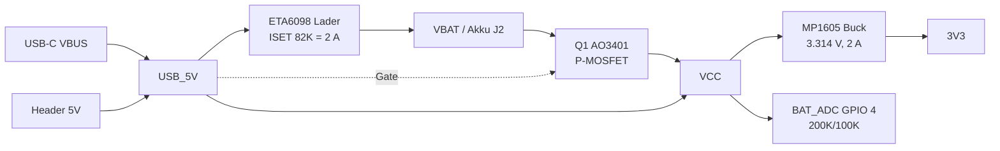

# Hardware: Waveshare ESP32-S3-Touch-AMOLED-1.64

Zusammenfassung aller bekannten Board-Informationen. Quellen: Waveshare-Wiki, der Schaltplan
(lokale Kopie: `ESP32-S3-Touch-AMOLED-1.64-schematic.pdf`) und die Waveshare-Demos
(`ESP32-S3-Touch-AMOLED-1.64-Demo.zip`, Arduino-BSP-Dateien).

## Uebersicht

| Baustein | Typ | Anbindung |
| --- | --- | --- |
| MCU | ESP32-S3 (Dual-Core LX7, 240 MHz, WiFi 2.4 GHz, BLE 5) | - |
| Flash | W25Q128JVSI, 16 MB | SPI (VDD_SPI) |
| PSRAM | 8 MB (ESP32-S3R8, laut Waveshare) | im Sketch deaktiviert (`PSRAM=disabled`) |
| Display | 1.64" AMOLED, 280 x 456 px, 16 Bit Farbe, Controller SH8601 (Waveshare nennt CO5300, registerkompatibel) | QSPI |
| Touch | FT3168, kapazitiv | I2C `0x38` |
| IMU | QMI8658 (6-Achsen Accel + Gyro) | I2C |
| TF-Karte | microSD-Slot (bis 64 GB, FAT) | SPI oder SDMMC 1-Bit |
| USB | USB-C, natives USB des ESP32-S3 (CDC/JTAG) | GPIO 19 (D-) / 20 (D+) |
| Lader | ETA6098 (Schaltregler-Lader, 2 A) | fest verdrahtet |
| Buck | MP1605GTF-Z, 3.3 V, max. 2 A | fest verdrahtet |
| Akku-Umschalter | AO3401 P-MOSFET (Q1) | Gate an USB_5V |
| Akku-Anschluss | PH1.25, 2-polig (J2), 3.7 V LiPo | VBAT |
| Antenne | onboard + U.FL/IPEX-Buchse (J3) | 0-Ohm Bruecke R17 |
| Taster | BOOT (GPIO 0), RESET (EN) | - |
| LED | gruene LED (LED2) ueber 3 K an VBAT | Power-Anzeige |
| Quarz | 40 MHz | - |

## GPIO-Belegung

### Display (QSPI, SH8601)

| Signal | GPIO |
| --- | --- |
| LCD_CS | 9 |
| LCD_CLK (PCLK) | 10 |
| LCD_D0 (SIO0) | 11 |
| LCD_D1 | 12 |
| LCD_D2 | 13 |
| LCD_D3 | 14 |
| LCD_RESET | 21 |
| Backlight | keins (AMOLED, Helligkeit per Controller-Register) |

Physisch 280 x 456 Pixel, Spaltenoffset 20. Der Controller kann nicht hardwareseitig drehen;
Landscape (456 x 280) wird ueber einen software-gedrehten `Arduino_Canvas` erzeugt.

### Touch (FT3168) und IMU (QMI8658)

| Signal | GPIO |
| --- | --- |
| SDA | 47 |
| SCL | 48 |
| TP_INT / TP_RESET | ueber den Display-FPC gefuehrt, kein freier GPIO (Polling) |
| IMU_INT1 | am QMI8658 vorhanden, im Projekt nicht genutzt |

I2C-Adressen: FT3168 `0x38`, QMI8658 `0x6B` (Standard, ADO an 3V3). Beide teilen sich denselben Bus
(Pull-ups R14/R15 10 K an 3V3). Der Header-Anschluss `SDA`/`SCL` liegt auf demselben Bus.

### TF-Karte

| Signal | GPIO | SPI-Modus | SDMMC 1-Bit |
| --- | --- | --- | --- |
| SD_CS | 38 | CS | - |
| SD_MOSI | 39 | MOSI | CMD |
| SD_MISO | 40 | MISO | D0 |
| SD_SCLK | 41 | SCLK | CLK |

Die Demo nutzt `SPI3_HOST`. Pull-ups 10 K (R25..R30) an 3V3.

### Analog

| Signal | GPIO | Bemerkung |
| --- | --- | --- |
| BAT_ADC | 4 | ADC1 Kanal 3, 12 dB Daempfung, Spannungsteiler 200 K / 100 K gegen GND -> `V = 3 * Vadc` |

BAT_ADC misst das Netz `VCC` (Eingang des Buck-Reglers), nicht direkt den Akku:
liegt 5 V an USB oder am Header, misst man ca. 4.9 V; im Akkubetrieb 3.3 ... 4.2 V.

### Sonstige

| Signal | GPIO |
| --- | --- |
| BOOT-Taster | 0 |
| U0TXD / U0RXD | 43 / 44 |
| USB D- / D+ | 19 / 20 |

## Stiftleisten (P1, P2: 2 x 11 Pins)

Belegung laut Schaltplan (Reihenfolge wie im Schaltplan gelistet):

`3V3, GND, VBAT, IO1, IO2, IO3, IO5, IO6, IO7, IO8, IO15, IO16, RXD, TXD, U_N, U_P, SDA, SCL, IO17, IO18, IO45, 5V`

| Pin | Bedeutung |
| --- | --- |
| 3V3 | Ausgang des MP1605 (max. 2 A gesamt inkl. Board) |
| GND | Masse |
| VBAT | Akku direkt (bzw. Ladeausgang des ETA6098) |
| 5V | Netz `USB_5V` = VBUS der USB-C-Buchse, ohne Diode |
| RXD / TXD | UART0 (GPIO 44 / 43) |
| U_N / U_P | USB D- / D+ (GPIO 19 / 20) |
| SDA / SCL | I2C-Bus von Touch und IMU (GPIO 47 / 48) |
| IO1, IO2, IO3, IO5, IO6, IO7, IO8, IO15, IO16, IO17, IO18, IO45 | frei nutzbare GPIOs |

Hinweise zu den freien GPIOs:

- GPIO 1 ... 8 und 15 ... 18 sind ADC1/ADC2-faehig (ADC2 ist bei aktivem WiFi nicht nutzbar).
- GPIO 45 ist ein Strapping-Pin (VDD_SPI-Spannung); beim Reset nicht extern auf High ziehen.
- Fuer die Slotcar-Hardware (Trigger, Bahnspannung, Ausgang zum Regler) stehen damit 12 GPIOs
  am Header zur Verfuegung.

## Stromversorgung

Details:

- **Eingang:** `USB_5V` kommt von der USB-C-Buchse (VBUS) und vom `5V`-Pin des Headers. Beide
  liegen direkt parallel (keine Diode, keine Strombegrenzung). USB und externe 5 V daher nicht
  gleichzeitig anschliessen.
- **Lader ETA6098:** VIN = `USB_5V`, Ausgang = `VBAT`. Ladestrom ueber R11 (ISET) = 82 K fest auf
  **2 A** eingestellt (Tabelle im Schaltplan: 820K 0.2 A, 360K 0.5 A, 220K 0.8 A, 180K 1 A,
  120K 1.5 A, 82K 2 A). Kein Enable-/Steuerpin, kein Temperatursensor. STAT-Pin ist nicht auf
  einen GPIO gefuehrt. Der Akku wird geladen, sobald 5 V an USB **oder** am Header anliegen.
  Das 5-V-Netzteil muss Board plus Ladestrom liefern koennen (bis ca. 2.5 A).
- **Umschaltung Q1 (AO3401):** Gate haengt an `USB_5V`, Source/Drain zwischen `VBAT` und `VCC`.
  Ohne 5 V ist der FET leitend -> `VCC = VBAT`. Mit 5 V sperrt er -> `VCC = USB_5V` (ca. 4.9 V),
  der Akku wird vom Verbraucher getrennt und nur geladen. Keine Softwaresteuerung moeglich.
- **Buck MP1605:** VIN 2.3 ... 5.5 V, VOUT = 0.6 V * (1 + 200 K / 44.2 K) = 3.314 V, max. 2 A,
  Spule 1 uH. EN ist fest an VIN -> immer aktiv, kein Software-Off. Das Board laeuft, solange
  `VCC` > ca. 2.3 V ist.
- **Tiefentladeschutz:** nicht vorhanden. Der Buck zieht den Akku bis unter 2.3 V leer. Der Akku
  sollte eine eigene Schutzschaltung haben; alternativ Low-Battery-Abschaltung per Software
  (Deep Sleep, Verbrauch dann minimal, aber nicht null).
- **Akku:** 3.7 V / 4.2 V Li-Ion/LiPo mit PH1.25-Stecker (J2). Polaritaet vor dem Anstecken pruefen,
  Waveshare-Akkus sind nicht immer gleich gepolt wie andere Hersteller.
- **Verbrauch:** AMOLED plus ESP32-S3 ohne WiFi typ. 100 ... 200 mA aus VBAT (Erfahrungswert,
  nicht gemessen).

## Firmware-relevante Fakten

- FQBN `esp32:esp32:esp32s3`, Optionen (aus `.vscode/arduino.json`): `USBMode=hwcdc`,
  `CDCOnBoot=default`, `FlashMode=qio`, `FlashSize=16M`, `PartitionScheme=app3M_fat9M_16MB`,
  `PSRAM=disabled`, `CPUFreq=240`.
- Serieller Port am Mac: `/dev/cu.usbmodem1101` (bzw. `usbmodem101`), natives USB-CDC.
- Download-Modus erzwingen: BOOT halten, RESET druecken und loslassen, dann BOOT loslassen.
- Display-Treiber im Projekt: `Arduino_GFX` (`Arduino_SH8601` auf `Arduino_ESP32QSPI`), Canvas
  mit Rotation 1, Spaltenoffset 20.
- Touch: FT3168 per Polling ueber `Wire` (SDA 47, SCL 48, 300 kHz).
- Spannungsmessung: `analogReadMilliVolts(4) * 3.0`, 8 Samples, alle 500 ms (`SUPPLY_*` in
  `display_unit.cpp`).

## Links

- Wiki: https://www.waveshare.com/wiki/ESP32-S3-Touch-AMOLED-1.64
- Schaltplan: https://files.waveshare.com/wiki/ESP32-S3-Touch-AMOLED-1.64/ESP32-S3-Touch-AMOLED-1.64-schematic.pdf
- Demo (Arduino + ESP-IDF, 93 MB): https://files.waveshare.com/wiki/ESP32-S3-Touch-AMOLED-1.64/ESP32-S3-Touch-AMOLED-1.64-Demo.zip
- Gehaeuse-/Massskizze: https://files.waveshare.com/wiki/ESP32-S3-Touch-AMOLED-1.64/ESP32-S3-Touch-AMOLED-1.64-DAD.zip
- Stiftleisten-Loethinweise: https://files.waveshare.com/wiki/ESP32-S3-Touch-AMOLED-1.64/ESP32-S3-Touch-AMOLED-1.64-JW_Explanation.pdf
- Datenblaetter: [CO5300](https://files.waveshare.com/wiki/common/Co5300_Datasheet.pdf),
  [QMI8658](https://files.waveshare.com/wiki/common/QMI8658C_datasheet_rev_0.9.pdf),
  [FT3168](https://files.waveshare.com/wiki/common/DATA_SHEET_FT3168.pdf),
  [ESP32-S3](https://files.waveshare.com/wiki/common/Esp32-s3_datasheet_en.pdf)
